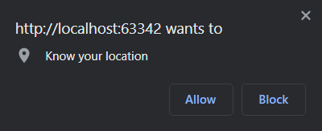
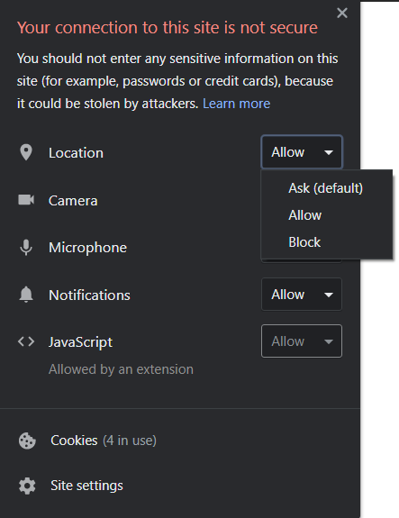

# geolocation-sample
A sample project to explore the geolocation feature.

### API(s)
+ Geolocation

### Instructions
+ Click the `Show my location` button to show your device location.
+ If it is your first time running this example, you are asked to grant/deny the location permission to the browser.
    
+ If you click `Allow`, the latitude and longitude of your location will appear on the screen. A link to show your location in [OpenStreetMap](https://www.openstreetmap.org) will be available.
+ If you click `Block`, an error alert will pop up.
+ You can still make the location permission popup appear by clicking on the Info button near the page URL and setting that permission properly. To apply the update, reload the page.
    

### Notes
+ The project has been tested on
    + Google Chrome 87 (both Desktop and mobile)
    + Mozilla Firefox 83 (both Desktop and mobile)

### Documentation and useful resources
+ [Geolocation API](https://developer.mozilla.org/en-US/docs/Web/API/Geolocation_API)
+ [Using the Geolocation API](https://developer.mozilla.org/en-US/docs/Web/API/Geolocation_API/Using_the_Geolocation_API)
